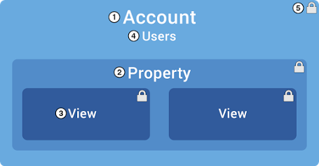
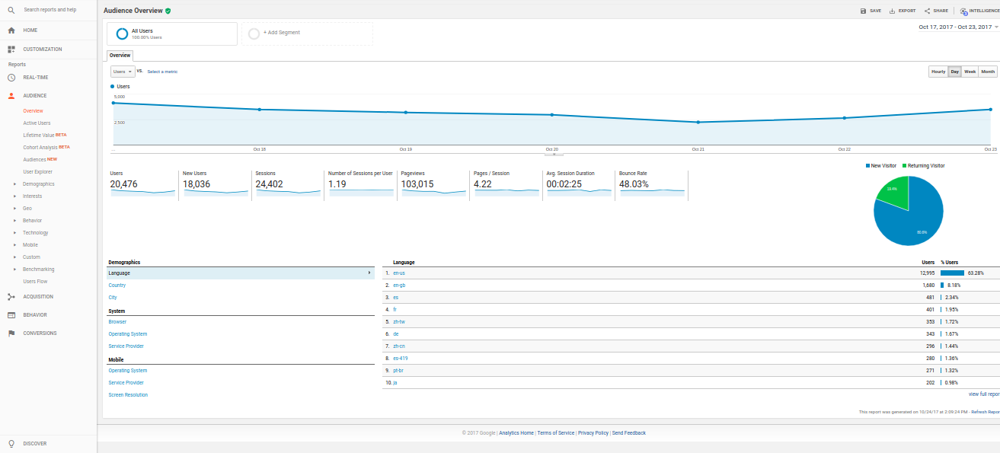
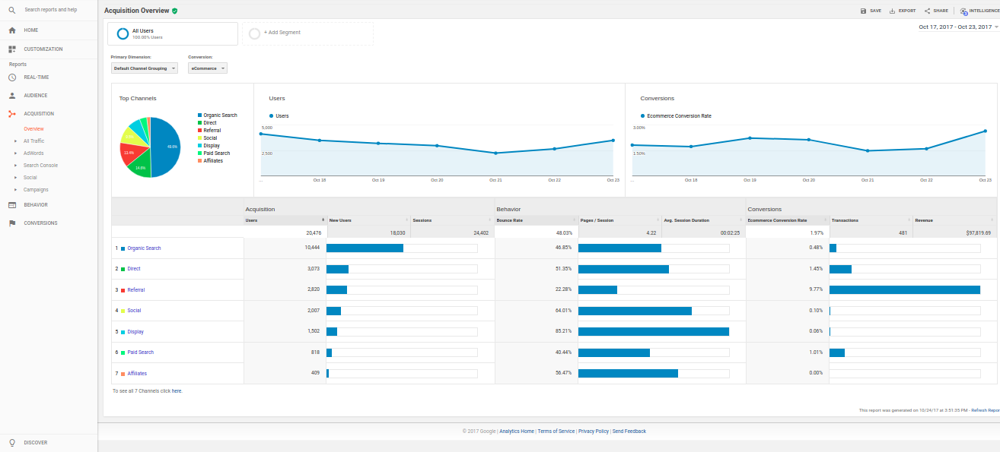
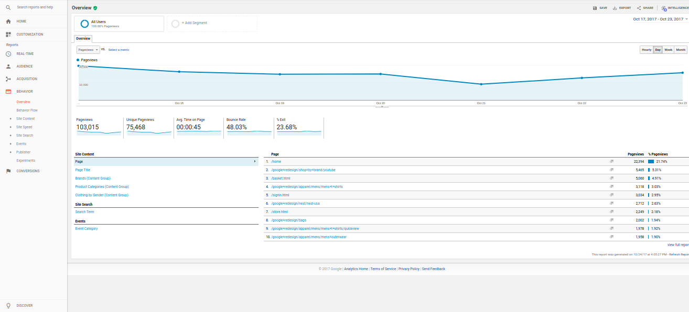

# Google Analytics

Nesta página trataremos dos conceitos fundamentais para que você possa trabalhar com o Google Analytics.

## Sumário

- [Permissões de Usuário](#permiss%C3%B5es-de-usu%C3%A1rio)
    - [Contas](#contas)
    - [Propriedades](#propriedades)
    - [Vistas das Propriedades](#vistas-das-propriedades)
- [O que são sessões?](#o-que-s%C3%A3o-sess%C3%B5es)
- [Audiência](#audi%C3%AAncia)
    - Usuários
    - Novos Usuários
    - Sessões
    - Número de Sessões p/ Usuário
    - Vizualizações
    - Páginas / Sessão
    - Duração Média de Uma Sessão
    - Bounce Rate
- [Aquisição](#aquisi%C3%A7%C3%A3o)
    - Orgânica
    - Direta
    - Referência
    - Social
    - Display
    - Paid Search
- [Comportamento](#comportamento)
- [Referências](#refer%C3%AAncias)

## Permissões de Usuário

Dentro do *analytics* há permissões para a edição e/ou leitura de suas métricas. Essas permissões são organizadas por um nó, onde em seu topo está a *Conta* e logo as *Propriedades* e *Views*. As permissões são concedidas verticalmente.

> O Google nos permite até 100 contas com 50 propriedades cada, que por sua vez, contém até no máximo 25 views em uma *Google Account*.

-----

Para que seja fácil compreender este conteúdo, imaginemos que somos donos do Google, beleza?

-----

### Contas

Se o seu negócio for algo simples como um *website ou aplicativo*, o nome da sua conta será o mesmo do negócio. Porém, nós ~~não somos pouca bosta~~ somos donos do Google e precisamos monitorar também outros serviços, como o Youtube, Gmail, Google Drive, Google Developers, etc...

A melhor maneira de monitorarmos esses serviços é criando **contas** separadas para cada um deles, assim podemos gerar relatórios mais precisos e organizados, consequentemente traremos análises mais relevantes conosco.

### Propriedades

Monitorar tantos serviços ao mesmo tempo não é fácil (mas tampouco impossível), as propriedades estão aí para nos ajudar neste árduo trabalho. Elas são como segmentadores que nos ajudam a levantar métricas mais úteis e relevantes para nosso cliente.

Digamos que o Google quer investir pesado em anúncios no próximo ano, mas primeiro precisamos saber em quais lugares temos maior *feedback positivo*, pois precisamos ir amaciando o terreno, para no final da campanha estarmos +EV com nossos investidores.

Por tanto, criaremos uma propriedade que segmentará nossa campanha por regiões, e a chamaremos de `Regiões`.

### Vistas das Propriedades

As vistas das propriedades *(a.k.a views)*, são outros tipos de segmentadores, eles segmentam as métricas adquiridas através de sua respectiva propriedade.

Em nosso caso, já sabemos que nos USA, Índia e China são os lugares que temos maior *feedback positivo*. No entanto, nossa verba está contatada ~~e infelizmente~~ nós não podemos lançar nossa campanha em todas as regiões destes países, queremos saber então, em quais regiões somos mais populares.

Para isso criamos, uma *view* específica para os USA, Índia e China, segmentando (com base em critérios não específicos) quais os lugares que nos trazem maior *feedback positivo*.

## O que são sessões?

Uma sessão é período do qual o usuário fica **ativo navegando** em seu website. Em caso de inatividade por mais de 30 minutos a sessão é encerrada, caso o usuário retorne a página, uma nova sessão é iniciada.

## Audiência

A seção audiência é auto-explicativa e a partir do Painel Overview é possível analisar métricas como:

- **Usuários** são aqueles que iniciaram pelo menos uma sessão em seu site.
- **Novos Usuários**
- **Sessões**
- **Número de Sessões p/ Usuário**
- **Vizualizações** é o número total de páginas visualizadas em seu site (páginas com refresh também são contadas)
- **Páginas / Sessão** total de páginas visitadas dentro de uma única sessão
- **Duração Média de Uma Sessão**
- **Bounce Rate** média de visitas sem nenhuma interação do usuário

## Aquisição

É através das métricas de aquisição *(a.k.a aquisition)* onde você sabe quais as mídias que seu usuário utiliza para acessar seu negócio, são elas:

- Orgânica
- Direta
- Referência
- Social
- Display
- Paid Search

## Comportamento

É através da seção comportamento *(a.k.a. behavior)* que você pode analisar o que seus usuários estão fazendo quando acessam seu negócio. As métricas utilizadas nessa seção são idênticas a *audiência* com exceção de:

- **Unique Pageviews** é o total de páginas visualizadas em seu site (nessa métrica o refresh NÃO é contado)
- **Saída** é uma média de quantas vezes o usuário saí da página (assim que acaba de entrar)

## Referências

- https://support.google.com/analytics/answer/1009618?hl=pt-BR
- https://support.google.com/analytics/answer/1102152?hl=pt-BR